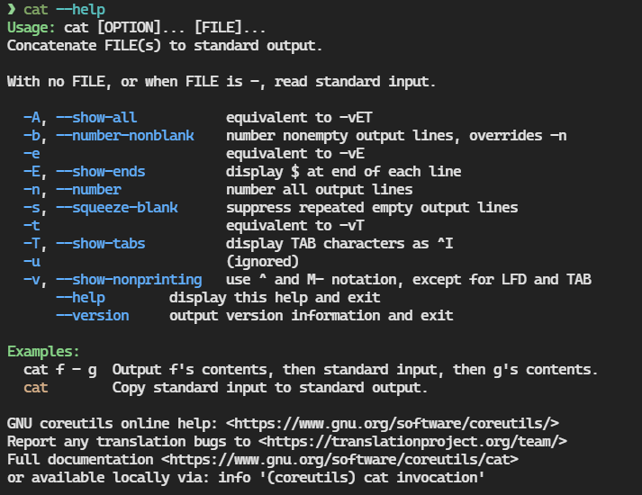
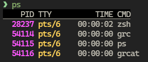

> 一个好看的 Console 就是一个好的 Console。
> 
> ——沃兹基硕德

## `cat` 高亮

`cat` 作为 GNU 时代的产物，在查看程序（或者配置）文件时没有高亮是很自然的一件事，但是确实不好看，感觉每次看 `.zshrc` 的时候都会把自己眼睛看晕。按照一般的思路，肯定有一个第三方的类 `cat` 工具可以实现这么个功能，所以我找到了以下两个东西：

### bat

[GitHub](https://github.com/sharkdp/bat)

~~好耶，是我最喜欢的Rust小玩具。~~

bat在 colorizing `cat` 的基础上加了很多别的料，比如它有一个类似 `less` 的 cli 界面，可以显示文件名和行数，以及内置的翻页。除了看文件之外还可以和 git 联动看文件 diff，据说还可以用来处理 stdout 或者作为 help 高亮的 wrapper 等等，但是我只关注替代 `cat` 这一件事，所以没看太多的用例。界面长这样：


有一些可以选择的 colorscheme~~，但是我感觉都不太好看~~，目前自己用的是 `OneHalfDark`，配置方法如下：

```Bash
# List available themes
bat --list-themes
# Generate configuration file
bat --generate-config-file

# ~/.config/bat/config
# Set the theme
--theme="OneHalfDark"
```

另：使用 bat 使 `--help` `-h` 高亮：

```Bash
# ~/.zshrc
alias -g -- -h='-h 2>&1 | bat --language=help --style=plain'
alias -g -- --help='--help 2>&1 | bat --language=help --style=plain'
```

效果：



### ccat

[GitHub](https://github.com/owenthereal/ccat)

用 Go 写的 colorizing `cat`，支持 `JavaScript`, `Java`, `Ruby`, `Python`, `Go`, `C`, `JSON` 等语言的高亮

体验更接近于只增加了高亮的原生 `cat` ，因为太像了所以反而没什么好说的

我个人更喜欢用这个，可能是因为习惯了原生 `cat` ，而且更习惯直接用 console 的翻页（是的我是 GUI 教徒）

## 全局高亮

后来在看日志的时候又发现日志里没有颜色，那有没有比较全局的高亮工具呢？

还真有，此事在 Arch Wiki 中亦有记载：[Color output in console - ArchWiki](https://wiki.archlinux.org/title/Color_output_in_console#Universal_wrappers "Color output in console - ArchWiki")

这个列表里面的大部分包都已经在现代包管理器里消失了，我们在这里只聊聊 [grc](https://github.com/garabik/grc)（Homebrew里有）。

grc 可以支持很多内置命令的结构高亮，加上一个前缀就行了：

```Bash
grc netstat
grc ping hostname
grc tail /var/log/syslog
grc ps aux
```

也可以直接写进 `.zshrc` 里，这样就不用加前缀了。我是从 Homebrew 安装的，所以实际的写法会不太一样：

```Bash
# Install from source/binary
[[ -s "/etc/grc.zsh" ]] && source /etc/grc.zsh

# Install from Homebrew
[[ -s "/home/linuxbrew/.linuxbrew/etc/grc.zsh" ]] && source /home/linuxbrew/.linuxbrew/etc/grc.zsh
```

效果：

