**声明1**

此部分并非文章原有内容，做一个简短说明。

此文章首发于2010年，修订于2013年，原作者未知（找了很久也没找到，如果有知情者可以私信我补上），鉴于百度和谷歌上的内容几乎残缺不堪，多年前看过这篇文章的本人将此保存下来以免日后真的消失于互联网上，考虑到原版排版较为混乱，所以特地修改了一下排版方式，部分含有连接的地方添加了超链接跳转，原文配的图也收集齐全并补充完备，但未对原文章有任何客观叙述和主观叙述上的不实修改。

全文共13272字，看后也许能感受到MAD的历史感也说不一定~ By 无疑

2020.7.27更新：本文转自MD上的蓝色天空，作者darklore

**声明2**

此部分亦非文章原有内容。

首先，十分感谢@Wuyi无疑对《山外青山楼外楼》这篇MAD史料的保存和整理。这里有TA整理后的版本：[https://docs.qq.com/doc/DUVpIbENuU21UQWl3](https://docs.qq.com/doc/DUVpIbENuU21UQWl3)

为了让Mader们更方便地接触与了解相关资源，我对这篇文章进行了简体化处理，并转载到B站。by储有奈

**声明3**

此部分亦非文章原有内容。

此声明写于 @Wuyi无疑 整理的腾讯文档版本失效后，我在寻觅全网，在Wayback Machine找到了在2012年版的原文，同时也终于知道了原作者的名字。查看原文格式排版后，许多转载文中不通之处得以化解，遂大喜过望，使用B站转载版与原文2012年01/04小幅修订版进行了交叉校对。此版简化优化了一些词汇（軟體->软件）及表达逻辑，并且对格式可读性进行了大幅改善（尤其是MAD分类部分的图表，直到看到原格式才了解文字是如何编排），希望各位阅读愉快，同时感谢所有对这篇文章进行整理的同好。by本子/文诗

本文转载自 [MAD的前世今生(2012年01/04小幅修訂版)](https://web.archive.org/web/20120703004508/http://mademad.liouming.net/bbs/redirect.php?tid=7&goto=lastpost#lastpost) ，作者 ourYvonne，同时根据B站转载版 [山外青山楼外楼——MAD的前世今生](https://www.bilibili.com/opus/510231050931745485) 进行了修订

**声明**

关于本篇文章，由于讨论的定义有许多并无广泛的认知与认同。也即可能会有不同看法，因此阅读之前尚祈读者能对不认同的观点有所容忍。

另外也欢迎提出不同观点，个人将尽力修订，使本文臻于完善。

文章授权 Copyright-采用CC授权请务必注明文章出处，文章链接与作者名称，同时请勿修改文章內容。

## 第一章 MAD的起源

#### 1-1-1 开端

1978年(昭和 53年) 『MAD』之名诞生（注1）。MAD这个词的由来，得从大阪艺术大学动漫画研究部CAS的三个成员说起。

1. MAD岛川氏 -自称本名为“元祖本家マッドテープ家元サウンディングマッド岛川”（CAS的创社元老之一）亦为创作团体Team S.I.N.的成员，至今（2010年5月）仍于ACG界活动。

2. Y氏（矢野健太郎）CAS的创社元老之一，CAS就是他与MAD岛川氏共同创立的。本人也是Team S.I.N.的长老。现为职业漫画家，偏好创作吸血鬼类的成人漫画。（台湾有发售其创作“异灵战士”，共3冊。此书并为著名台湾成人文学创作“魔王重生-銀色魔女”的原型）

3. 金井聪90年代中以人偶动画名扬全日本，之后因特摄制作的长才进入动画业界。代表作如“平成魔斯拉”等。当前设有官方网站”舞映＆JCC”（http://www.lares.dti.ne.jp/~maimilk/index.html）。

这三人在CAS中陆续制作出许多以动画人物的声音或是片中音乐来剪接恶搞的录音带作品，并命名为“奇知害低符”（其发音正是“きちがいテープ”[氣違いテープ，意即“疯狂录音带”]）。

为什么刻意用这几个汉字来表示？因为“氣違い”有着“一时的疯狂”之意，但是大部分的日本人常会误解这个词，认为这是一种描述病态的名称。于是为了符合初衷且降低局外人的误解，他们使用了这几个汉字。

#### 1-1-2 从“奇知害低符”到“MAD”

在MAD岛川氏制作完第10卷“奇知害低符”作品之后不久，有一个非常迷歌手“山口百惠”的朋友前来拜托他：“可以把你的山口百惠唱片全都转录成录音带给我吗？”于是他巧手剪辑，完成了第11部作品：

“**クレイジー． カセット No.11 TAPE C-60**”

A面标题-MOMOE MAD-30分17秒(山口百惠的罗马拼音为 Momoe Yamaguchi)

B面标题-前奏.间奏系列-30分28秒

值得一提的是，A面标题是之后他朋友命名的，而且这位朋友拿到带子之后爱不释手，天天从早听到晚，MAD岛川氏不知是受到感动或者是受到朋友神来一笔的刺激，宣布今后的公开作品名称将从“奇知害低符”改为“MAD-TAPE”！“MAD”之名就此诞生，并沿用至今。

从此正式建立『MAD』的名称－之后也有人称呼『MAD』为『M@D』或是『二次创作ムービー』（注1）MAD一词的使用在东亚各国Fans中非常普遍，基本上认定二次创作ACG影片=MAD。

这是比较可信的历史考证结果，然而因为有关于MAD的起源说法尚有数种，时至今日已经难以考察真伪。

#### 1-2-1 关于AMV

AMV指Anime Music Video，由一个或多个动画混合编辑并配乐制作而成。

AMV一词的语源已不可考，现有可查阅到的资料显示，在1980年代初期AMV一词已经开始使用，是比较可靠的说法。

相对于MAD一词普遍在东亚使用，西方国家如英，美，法，德等则以“AMV(Anime Music Video)”称呼其二创影片。（注2）

#### 1-2-2 AMV和MAD的不同

由于AMV的“A”代表英文单词“Anime”，因此可以看出AMV的定义基本上就是使用动画或游戏的动画来制作的影片。（注3）

至于MAD则多数以静止素材制作，然而其作品很明显较为多样化，相比之下作者的创作素材范围也比较有弹性，基本上和ACG（Anime,Comic,Game）有关即可使用（注4）。2006年初举办的SM@DXSM@D竞赛中，有数部以动画为素材的作品参加了比赛即是明显的范例。（注5）

另外，日本举办MAD创作比赛时，若要求创作者以静画素材制作，会在大会Logo上特别打上“静止系MAD”（注6）。

走笔至此，或可做一定的归纳。对于Madders来说，MAD大致分为：

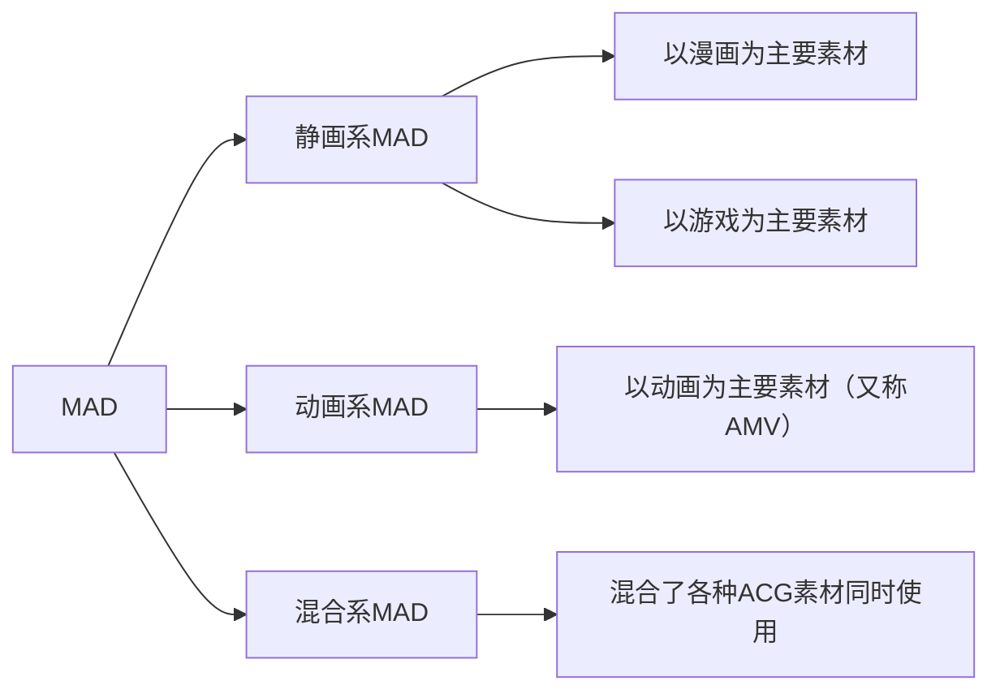

所以按此推断，可以注意到AMV应该算是广义MAD的其中一个分支而已，也就是说基本上动画系MAD就是AMV,但MAD则不能与AMV一概而论

### 1-3 MAD创作早期简史

*在这部分主要提及的是日系MAD

**1978-1995**

如前所述，MAD诞生得很早。但由于七八十年代仍是录影带时代，个人电脑尚不普及，MAD的创作难度超高，设备不足，既缺乏流通管道亦缺乏阅听者……MAD虽然已经诞生，但无甚发展，直到90年代初………

**1997年6月**

台湾最大的动画OPED下载网站“光之大陆 伊莉琴斯”成立，其中的物资管理局提供许多在当时难以入手的OPED，除此之外，也有大量收集职人在其上提供MAD的下载，对台湾早期的MAD推广奉献甚大。

**1996-1999年3月**

从96年到99年初，随着多部H-Game的发售以及个人电脑的普及，MAD创作开始增加。被视为MAD界革命预兆的便是99年3月乃怒亚女氏所创作的“｢メビウスONE｣β版”，这也是第一部大小超过100MB的MAD。

本时期的创作仍以160X120为主，320X240未成为主流，创作的主题几乎全部是H-game，例如“One”等……

**2000年9月**

新海诚作品“彼女と彼女の猫 -Their standing points-”公开。

1999年6月-2001年1月20日，MAD界迎来第一次兴盛时期。

**1999年6月**

MAD创作的速度逐渐增加，推定在99年6月时总数已突破100部。夏季左右时，320X240终于成为主流。

**1999年11月**

日本国会通过“儿童福利法”，“智慧财产权保护法”，大多数创作者苦于应对法律问题，造成部分作家转入地下及引退。

**2000年3月**

乃怒亚女就职，开始逐渐淡出MAD界。

**2000年9月**

MAD界开始有组织的举办MAD大赏等活动，9月时公开了“新人赏”的参加作品。

**2000年9月**

新海诚作品“彼女と彼女の猫 -Their standing points-”公开。

**2000年10月-12月**

-由“神艺工房”代表“神月社”领头，开催了第一届“华音赏”，得到热烈的回响，最后共有52名作家参与。12/12日，第二届“新人赏”亦开始筹备活动。

-神月社，乃怒亚女，SATURN等中坚MAD作家先后声称将在2001年引退。

**2001年1月20日**

Key社注意到大量Madders使用其发售作品作为素材创作MAD，并公开去信警告其已触犯著作权法，造成MAD界大地震，多位实力派MAD作家相继发表引退宣言。次日，除华音赏及新人赏外，数个相关活动亦相继中止。其他相关的创作领域亦人人自危，壁纸创作大会“灯火赏”因此中止，2ch壁纸版亦因此关闭。

**2001年1月28日**

AK-1公开Air MAD作品“Azurewind”。这部MAD以观玲为主体进行创作，在制作上使用了许多华丽的技巧，至今在Air的静止系MAD创作中仍颇有名声。

（Azurewind为2001年静止画MAD大赏的第二名）

值得注意的是本作的解析度已经是640X480（即DVD格式的画素量），由Azurewind之后640X480的高解析度MAD逐渐多了起来。

**2001年1月底**

神月社正式宣布自MAD界引退，之后转入AVG OPED商业制作范畴，并活跃至今（2010.6）。

**2001年2月**

日本动画职人异端氏在神艺工房公布栏声称“MAD界作品的画质音质普遍低落”，遭到版友围剿。以此事为契机，日本静止画作者在制作MAD时，逐渐以高Bitrate（每秒资料流量）为目标进行作业。

由于许多作家并未完整的了解压制档案的方法，档案的过度肥大成为此时期MAD的一大问题。

**2001年4月11日**

台湾发生“成大411MP3事件”：

台南地检署接到IFPI（国际唱片业交流协会）举报，前往国立成功大学学生宿舍“胜一舍”搜索，查获十四名学生涉嫌非法下载MP3，及架设网站提供一万八千多首歌的MP3供人下载。

由于搜索过程粗暴且警方行动违反大学法之大学自治原则，该搜索行动引起学生强烈抵触与恐慌。此事件连带导致中山大学架设的伊莉琴斯被严重关切，声势大为衰颓。

**2001年4月16日**

Key社再度发送警告勿侵权Mail给各相关站点（这次的目标主要是壁纸制作的网站），通称为Key4.16事件。在影响上不如一月份来得大，大多数的网站均在削除Key社相关资料后继续经营。

**2001年5月3日**

MAD团体“M2 Union”的Mist氏完成史上第一部合法MAD“iniquity”。在这个时期，日本各个游戏制作公司对于MAD的制作态度趋向于两极分化，有极度排斥的（如Key社），亦有表示充分支持的（如授权Mist氏创作的Witch社，已结束营业）。大体而言，公司规模越大，越倾向于禁止MAD的制作。

**2001年8月3日**

Minori发布AVG作品“BITTERSWEET FOOLS”的Demo Movie。由新海诚制作的此部Demo获得极高的评价，其名由此逐渐广为MAD爱好者所知。

**2001年8月**

全世界最大的AMV原档保管库AMV Music Video.org（[http://www.animemusicvideos.org/home/home.php](http://www.animemusicvideos.org/home/home.php)）由Kris领导成立，宣称其终极目标为收集一切曾被创作出来的AMV。

**2001年12月29日**

由美凪ちよ主办的“あなたが選ぶ静止画MAD大赏2001”开始投票，在接下来的10年间这个活动以票选出当年最佳的MAD为目的持续举办。

**2001年8月~12月**

在夏季Comicket上由同人社团Type-Moon所发布的月姬系列关联作品“歌月十夜”成为热门话题，月姬系列的MAD开始出现。

**2001年9月~12月**

由于对特效的需求，使用Adobe Aftereffects制作MAD在日本成为主流，在这之前使用Premiere的作家比较多。

**2001年11月11日**

神月社领导之主要MAD团体“神艺工房”由于神月社本人转向商业AVG OPED制作而宣布解散，预计在发布完最后三部作品后关闭网站，宣告了一个时代的终结。

**2002年4月5日**

神艺工房网站消灭。

**2002年3月4日**

Minori公开由新海诚制作的Wind-A Breath of Heart- Demo Movie，以当时的技术水准来说是极为惊人，这之后新海诚在ACG圈声名大噪。

**2002年6月22日**

Littlewitch公开首部AVG作品“白诘草话”的OP。
这支动作OP非常优秀，谣传称它用掉了游戏制作预算的90%。

**2002年7月18日**

Type-Moon第二部AVG“Fate/Stay Night”情报开始公开。

**2002年9月22日**

“月姬”决定进行动画化，成为首部动画化的同人作品，Type-Moon与Key社几乎占据此时期2/3MAD的原作。

**2002年10月4日**

由神月社操刀的 “Baldr Force” Demo Movie公开。配合感电注意制作的3DCG以及Kotoko的主题曲，此Demo成为业界极为优秀的作品。大量仿制的MAD在之后几年间不断的出现。

**2002年12月28日**

渡边制作所在日本Comicket 62上公开Type-Moon系列同人游戏“Melty Blood”，开启了制作Melty Blood GMV的一股风潮。

**2004年10月2日**

中国大陆MAD组织“雪舞清盈（FLSnow）”成立MAD版。

**2006年3月**

光之大陆 伊莉琴斯由于外在环境的恶化，关闭了最后一个留存的物资管理局版面，台湾MAD与OPED的收集与传播开始进入论坛林立的战国时代。

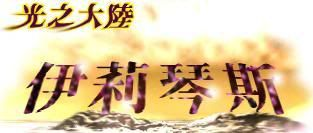

**2006年9月**

流鸣联合本居MAD版成立，在接下来的数年间逐渐发展MAD分享与创作事业。

**2006年12月1日**

曾制作包含《Memories Off》，《Ever 17》等游戏在内的著名AVG游戏会社KID宣告破产。

**2006年12月12日**

日本方面日后撼动全MAD界生态的Niconico动画（[http://www.nicovideo.jp/](http://www.nicovideo.jp/)）开始运营，其独创的即时影片留言制度深刻改变了MAD的评论方法，并为许多网站所效法。

**2007年10月14日**

中央大学歌谣祭期间以主办单位领头，参与者合唱许多ACG组曲，事后由日本方面媒体工作者录影后上传至Nico，短短三天便累积了12万人次观赏，被称为是近期交流的最佳范例之一。

**2008年1月21日**

台湾举办第一届MADeMAD大赏（主办：鬼娃娃伊帆）。

**2008年3月21日**

中国大陆MAD组织Sakuramai（樱舞）成立。

**2008年9月9日**

台湾MAD组“HSM@D”成立，以振兴台湾MAD事业为目标营运。但人数不足，始终未拿出显著成绩。

**2008年12月9日**

台湾政府针对ACG产业侵权进行大规模扫荡，许多台湾本土的ACG下载相关网站遭到重击。流鸣联合本居亦因此关闭了MAD分享版，从此没有恢复。台湾的MAD交流一蹶不振，分享者与作者大多转入MAD发展正方兴未艾的中国大陆论坛。

**2009年3月3日**

中国大陆MAD组织“泷沉琉璃MAD工坊（RL MAD Team）”成立。

**2010年11月10日**

台湾MAD组织“HSMAD”大规模改组后重新开展活动，并开始筹办台湾作家限定的赛事。

**2010年12月8日**

中国大陆MAD组织“Towiko MAD”成立。

**2011-2012年**

在日本MAD界，“原档”MAD的发布开始逐渐被NICONICO动画的线上发布取代。

**2011年3月1日~2日**

台湾限定专属MAD Event “MAD大乱斗”活动。

**2011年8月19日~9月初**

MADeMAD 2011 活动（主办：darklore）。

第一届中国大陆MAD新人战（主办：盒子）。

### 1-4 其它特殊分类

#### 1-4-1 FMV

FMV的F代表Fighting（战斗），FMV就是战斗纪录影片（Fighting Movie Video）的缩写。由于许多格斗游戏的玩家需要观摩其他强者的对战影片以研究对战方法或练功，这类影片数量渐增，卓然成家。

直到Melty Blood ReAct（MBR，月姬格斗）这款游戏以后，将这类影片配乐剪接出节奏及艺术感的风气更盛，这就形成了今日所称的FMV。

然而FMV的重心仍然是让游戏玩家练功观摩，基本上仍然欠缺较复杂的MAD制作技巧。

#### 1-4-2 剧情系AMV/MAD

这种AMV基本上都是欧美国家所制作，内容上都含有大量剧情，和纯音乐系AMV（较接近MTV）差异相当大。这类作品不容易做好，但是做好之后往往有惊人的效果。

对于阅听者而言，最大的问题在于语言……能力不足对于欣赏这类作品有相当的障碍。虽然有少数作品不包含外语对话，但这类作品极少。

静画系的MAD大致采用不断切进淡出的配乐字幕叙述剧情，代表作是已引退的Koba-U氏所制作的“If”（原素材为月姬）。

因此，基本上在静画MAD作品中不存在纯粹的剧情系作品，为免混淆起见，不以此为主进行分类。

#### 1-4-3 音乐系MAD/AMV

以音乐为主题的作品称之。

相当一大部分的MAD/AMV作品均属于此类，做成的作品如果是AMV，就跟MTV相当接近了。

台湾这方面的创作以国立中央大学为大本营，并有代表作者萧剑龙氏。

#### 1-4-4 iMADs(im@ds)

iMADs是晚近（2008年底左右）才兴起的新型MAD种类，乃是由著名偶像培养软件“The idol Master”以及其它类似的软件而发展出来的新分类。

特色是由Madder们先编写舞者舞步，再进行一般的MAD编辑作业，充满正统MAD以外的另类活力与美感。值得注意的是，目前越来越多作者将本类型作品易称为MMD。除此之外，以idol master软件制作的正统iMADs亦已逐渐没落中，即便是原游戏制作公司在2011年底推出了第二代idol Master的编辑软件，然而随着MMD阵营的不断壮大，其颓势并未有所转变。

作品赏析：

[MAD]The Idol Master-V-[Project VA]（[https://www.nicovideo.jp/watch/SM4821152](https://www.nicovideo.jp/watch/SM4821152)）

The Idol Master-2008 秋の祭典（[https://www.nicovideo.jp/watch/SM5537811](https://www.nicovideo.jp/watch/SM5537811)）

| 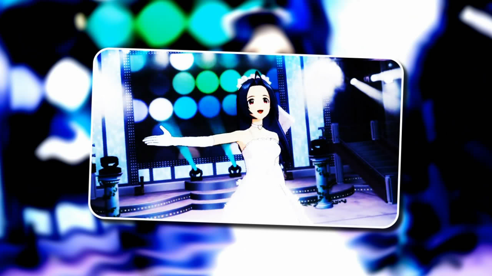 | 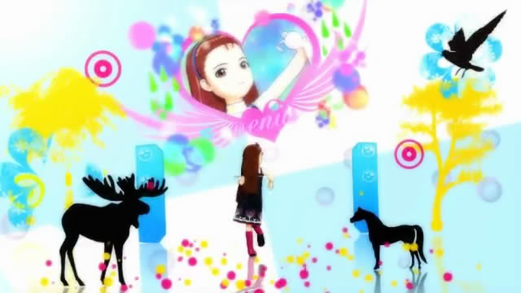 |
|------------------------------|------------------------------|
| 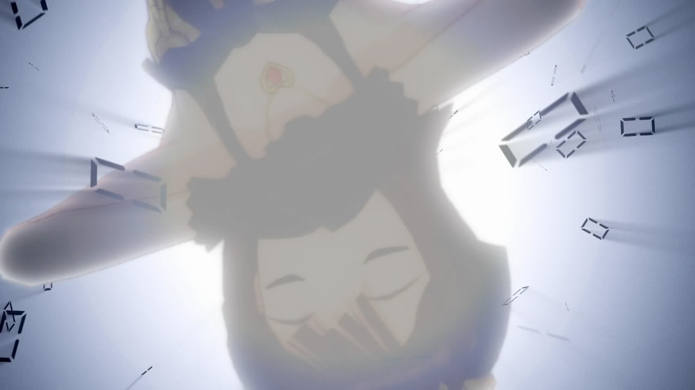 | 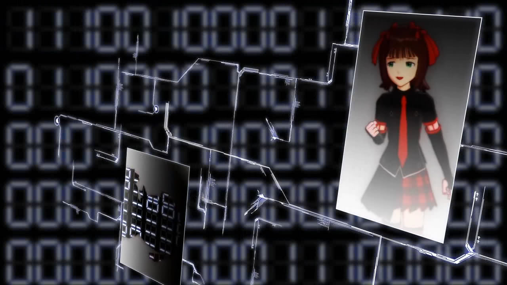 |

#### 1-4-5 MMD

MMD是其制作软体MikuMikuDance的缩写，一般界定的标准是以此软体制作片子的影像部分即称为MMD。

MMD为日本人樋口优所开发，原先是用以制作初音系列3D MV的软体，不过其后开发了大量的其他ACG人物模组（尤其是东方系列），而在人物模型的风格方面，则以LAT式，ISAO式与TDA式MMD较为有名。

时至今日，MMD已发展为多元化的3D ACG影片制作平台，并有专属的定期比赛（请参照MMD杯一节）。

由于作者本人引退，MMD软体目前已经停止更新，最终版本号为7.39（有兴趣专门探索MMD相关资料者，请参考附录所列MMD论坛）。

LAT式MMD 作品赏析：

Hatsune Miku-Electric Love[Wakamura]（[https://nicovideo.jp/watch/SM12234304](https://nicovideo.jp/watch/SM12234304)）

Hatsune Miku-Sweet Devil MMDPV[Wakamura]（[https://nicovideo.jp/watch/SM12392042](https://nicovideo.jp/watch/SM12392042)）

| 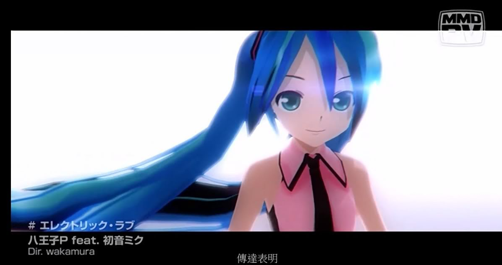 |  |
|------------------------------|------------------------------|
| 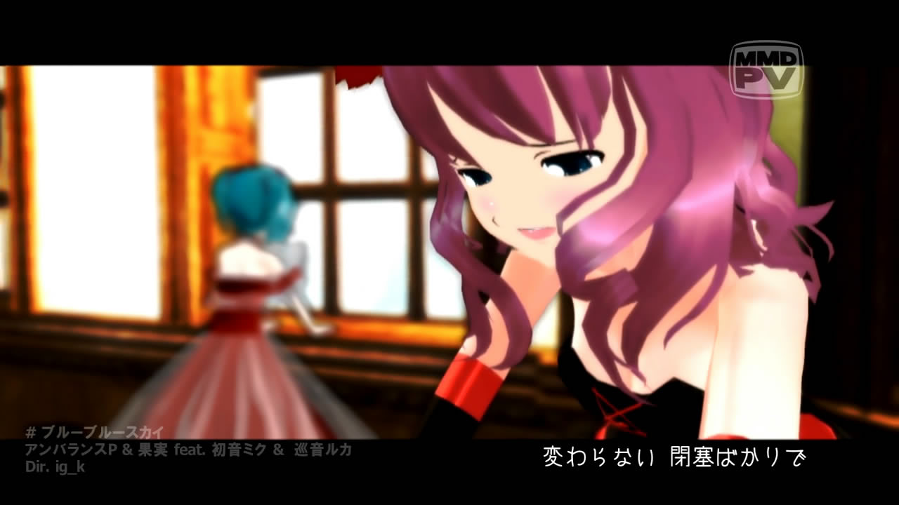 |  |

#### 1-4-6 音系MAD

音系MAD是指重心多在作品音乐上而非画面上的一种MAD。粗略的分可以分成以下两种：

(a)音MAD：这种MAD一般藉由合成原本作品的曲子不停的loop而达到爆笑崩坏的效果，又被称为“吵杂MAD”，如前几年有名的“蓝蓝路”就是这种作品的代表。

(b)空耳：空耳是指作品的原曲听起来很像别的意思完全不同的句子，如著名的上古卷轴5主题曲就曾被空耳为全中文歌曲。

## 第二章 MAD的特色

### 2-1 因热情而产生

由MAD产生的历史可以发现，MAD的源起与官方并无关联。基于这一点，笔者认为MAD必须具备的一大条件便是由非官方团体或个人来制作。

### 2-2 二次创作与三次创作

#### 2-2-1 二次创作

由于MAD是由喜好作品的非官方个人或团体自行制作而成，因此不可避免的会大量使用到原作的画面以及音乐等加以修改后成为作品（这种拿原创物再次进行加工的创作过程一般称为二次创作）。无论是对画面被使用的企业或是音乐被使用的歌手来说，这都是令人喜忧参半的现象，然而并非每间公司企业都能有雅量来包容MAD创作的团体，如角川文库就曾经在nico（日本最大的视讯网站）上大力扫荡其相关MAD。即使最终角川改变了立场，此事仍然突显出MAD制作的不确定风险。

#### 2-2-2 三次创作

有一种情形是使用其他作家的旧MAD做为新MAD的素材，一般在MAD圈里严格禁止此类行为，严重者可以遭到MAD圈内的社会性抹杀。最著名的例子如“四四 事件”中的HO君（注9）。另外大量使用“模版”（一种预先设计好可供简单设定后做出复杂场景的半成品MAD专案）去进行制作也被部分静画系作家认为是相当低级的行为。

### 2-3 本版提供的定义

“MAD是一种非由企业或官方制作的影片作品，其使用的素材部分为自行创作，部分则是创作者由原作中取得，并加工而成。”

以上或可作为笔者本身对MAD的定义看法…由于MAD在即使是在ACG界亦无严谨定义其内涵，是故推广于讨论时常因此会遇到困难，尤其是许多作品同时具有多项属性，导致界定其名称几乎变成不可能达成的任务。直到2012年的现在，界定上的混乱仍然是初入门者一个巨大的麻烦。

P.S.：实际上中文维基有MAD的定义栏，然而个人认为它的文章大有问题（2012/9）。由于迄未解决，作为补充参考用似较佳。

## 第三章 2005年以来的MAD活动与大赏

在早期，MAD无论是在创作以及传播方面，由于电脑本身硬体的限制以及外在环境不利于发展，难以取得较大的成就，因此本节谨以2005年作为起点开始说明。

### 3-1 MAD活动

#### 3-1-1 日本MAD活动

作为最早开始发展MAD的国家，MAD赛事的数量与品质都毋庸置疑是最多最高的。

1. 红白MAD合战

（基本上每年一次的定期EVENT，但2012年起似已停办并为其他活动取代），当前日本水准最高的MAD大会，基本上每年均会进行一次赛事，可说日本最优秀的静画系作家均集结于此大会中。主要为邀请制，无法任意报名。

水准极高且整齐划一，MAD爱好者不应错过的盛会。

2. SM@DxSM@D(基本上每年一次的定期EVENT，但2012年起似已停办)

日本赛事中以发掘新人为目的所举办的赛事。一般而言必须是新人（出道在一年以内）才能参赛，不过每年的规则会有细微变动。为报名制。

水准亦称良好，然个别参赛者有时会有差异极大的现象。

3. 黑组MAD赛（不定期活动）

技术上来说黑组MAD赛存在的用意是让来不及做完红白作品的作家们放流MAD的赛事，常常充满了主办们的恶趣味…例如全作者假名发表作品（因为红白失格吗XD），或者是模仿其他红白作品的恶搞MAD等等。

有很多良作，特点是需要猜作者是誰（尤其是09年这届），以及恶搞MAD特别多（尤其是第一届）。

4. ニコニコ紅白MAD合戰(基本上每年一次的定期EVENT)

（[http://www.nicovideo.jp/tag/%E7%B4%85%E7%99%BDMAD%E5%90%88%E6%88%A6%E3%80%8C%E7%B4%85%E7%B5%84%E3%80%8D](http://www.nicovideo.jp/tag/%E7%B4%85%E7%99%BDMAD%E5%90%88%E6%88%A6%E3%80%8C%E7%B4%85%E7%B5%84%E3%80%8D)）

2007年至2012年9月共计已举办过5次的MAD赛事，为开放报名制，作品水准中平。唯一的大问题是由于不放流高画质档，并无清晰档案可供收集用，是Collectors的一大憾事。

5. MAD晒しの宴(基本上三到四个月会有一次的赛事)

（[http://www3.atword.jp/mad/](http://www3.atword.jp/mad/)）

在Nico上举办的MAD赛事。到2012年9月为止已经举办了惊人的57次。产量大，质量较低，基本上只是提供Madders晒MAD的场合，并无其他正规赛事的投计票/选拔等流程，同样地也不提供高画质档案。

6. WAKUWAKU團（わくわくアルバム－嬲られる僕の思い出－）（基本上每年一次的定期EVENT）

2010（[http://omanchin.web.fc2.com/](http://omanchin.web.fc2.com/)）

2011（[http://wakuwakudan.web.fc2.com/](http://wakuwakudan.web.fc2.com/)）

2009年首度办理，至2011年9月10日举办第三届，前两届均在单身汉节（11/11公开）第二届有点类似没女友Madder们的怨念MAD大会….作品不限定为首度公开，亦未限制个人投稿数。第三届作品的高画质原档官网目前已经公开。WAKUWAKU团的创立虽然原来是因活动而产生，但随着其活动的频繁性，有组织定型化的倾向，值得期待。

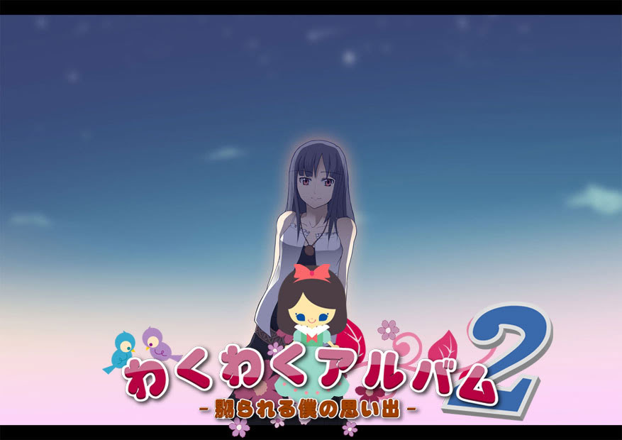

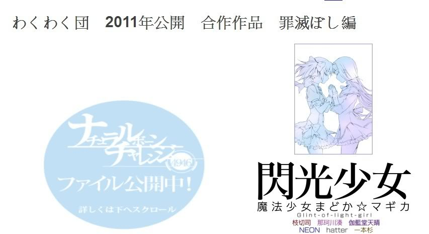

7. MMD杯（[http://www31.atwiki.jp/mmdcup/](http://www31.atwiki.jp/mmdcup/)）

MMD杯是限定使用软体为MikuMikuDance才能参赛的作品，2008年以降已经举办9次，初期以初音MV为主，由于是民间爱好者开发的软体，随着周边模组的不断开发，至今创作范围已逐渐扩张到初音家族以外（如东方系列等）。

该赛事的运作模式是参赛者从几个题目中选出一个，并以该题目为基准做出短片参加予选（此阶段提供半成品即可，如CM）与本选（必需是完成品）两个阶段。在每一个阶段，参赛者都会同时在Nico上公开作品，并计算一段固定时间内被加入Mylist的数量，最多者为优胜，并将记录于MMD Wiki上作为纪念。

8. MADMAX（[http://www.bisuke.biz/~gunma/mad_max/top.html](http://www31.atwiki.jp/mmdcup/)）

MADMAX是由日本主要MAD创作团体“Visitor”所主办的MAD活动，由于2011年日本并无红白MAD合战，因此估计本活动是为了填补其缺位而举办的小型EVENT。

开始时间是2011年12月24日，有8名作者参赛。

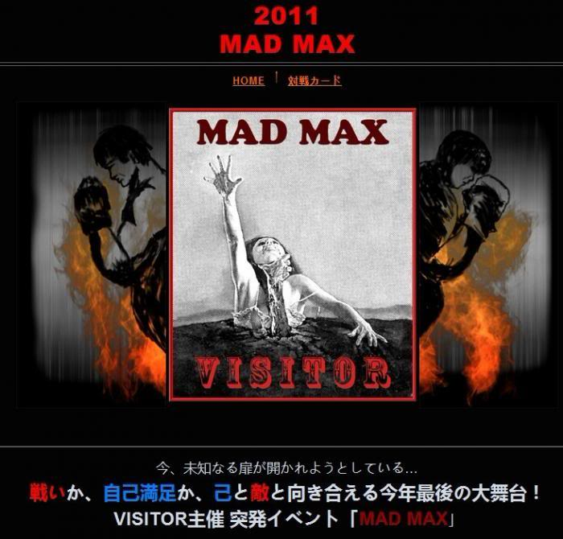

I.Author Imagine MAD Festival(AIMF)（[http://aimf2012.blog.fc2.com/](http://www31.atwiki.jp/mmdcup/)）

(影片发布站为Nico:[http://www.nicovideo.jp/tag/AuthorImagineMADFestival](http://www.nicovideo.jp/tag/AuthorImagineMADFestival))

AIMF和数年前举办的Nameless基本上属于同类型的MAD活动，都是发布者在发布时匿名，原档则是各作者自行决定之后要不要公开，观众以观察并猜测mad作者得到乐趣。但是本次大会作为2012年实际上取代了历年来传统MAD赛事红白合战的活动，完全没有公开发布原高画质档案，或可视为日本MAD界作品发布倾向改变的重要信号。

---

以下是日本已停办数年，可能不会再有后续的活动：

1. 山椒は小粒でピリリと辛い!?（只出现过一次的MAD赛事）

只在2007年出现过一次的MAD比赛，由于该年并未举办红白MAD合战，因此可说是代替其地位的赛事。作品水准高，数量较红白略少。

2. 绿组与黄组MAD战（只出现过一次的MAD赛事）

传说中只出现过一次的MAD小型赛事，主要是处罚红白失格Madders与限时制作MAD的趣味竞赛。由于是非正规的比赛，水准上属于玩票程度。

3. Nameless（[http://zoome.jp/sirotora/diary/47/](http://zoome.jp/sirotora/diary/47/)）

2009年开始在Nico上举行的小型Event，主人为作者提交作品后不署名，原档则是各作者自行决定之后要不要公开，运作模式类似于中国的黑暗火锅大会，观众以观察并猜测mad作者得到乐趣。

*2012年6月5日确认尚无年度活动计划。

#### 3-1-2 中国大陆MAD活动

由于经济快速兴起，加以庞大的人口基数，中国大陆近年来MAD活动的发展也越来越进步。

1. 春秋合战（基本上每年一次的定期EVENT）（[http://seeasea.net/sprau/](http://seeasea.net/sprau/)）

由龙岚君所独立主办的MAD活动，为中国最大型的MAD祭典。当前的参赛制度逐渐向邀请制过渡。其中FLSnow作为中国成立最早的MAD组织，有一大部分作家会在此活动中发表作品，是故春秋合战参赛的静画系作家相当多。

另除了参赛制度完善，水准整齐之外，每年春秋合战的参加MAD数亦相当惊人，俨然是中国风味的“日本红白MAD合战”。

2010年仅举办春秋火锅，整体而言较接近原黑暗火锅大会的风格，2012年起由叶月接手主催，并将于11月左右开始举办。（该活动并非由FLSnow主办，经龙岚君通电指正，特此声明。）

2. 光舞DVD(基本上每年一次的定期EVENT)

光舞DVD是FLSnow组内特有的MAD DVD，大约在每年春天时在各地同人会上贩售，另也接受中国国内邮购。对于无法购入者，亦提供画质较低的版本在网路上可供免费下载。

内容上包含了华语圈各个活动的优秀作品，同时也适度的加入华语圈各地作家的未公开新作/相关的MAD制作教程内容等。截至2009年2月，光舞共计发行了四次DVD，然2012年9月为止尚无再度发行计划。

3. 黑暗火锅大会（不定期EVENT）

雪舞在2007年首次举办此MAD活动。特点是参与者的素材由其各自带来，然后随机抽选，作者必须以抽到的素材制作。

纯粹娱乐与恶搞取向的小型MAD活动，作品水准中平，至2012年9月共举办了2届。

4. 樱舞（Sakuramai,SKM）年度活动（基本上每年一次的定期EVENT）

2009年SKM内部在农历新年首次进行的组内MAD展示大会，属于成果展览类活动。作为历史较长的中国大陆MAD组织，SKM每年推出的静画系作品亦有相当数量，然水准上差异较大，为遗珠之憾。自第二届开始，情人祭就改为白色情人祭，于3.14活动。

5. 琉璃工房（Raindrop Lazurite,RL）夏日祭（每年一次的定期EVENT）

琉璃工房于2009年夏天首度举办的组内MAD展示大会，亦为成果展览类活动。至2012年底为止共举办4届。

夏日祭活动本身由于新手作家数量较多，作品程度尚不尽人意。但若将其组织在09年发布的DVD对比，可以注意到其Madders成长得非常快，令人相当期待。

6. 泷沉琉璃MAD工坊年度DVD COLLECTION（每年一片）

RL在2009年底开始发布组成果展览用DVD，2009年版的内容上包含了夏日祭/组内新作品合集/TMD组作品三部分。内容上全为RL本组的作品品项，然而值得注意的是，这部DVD的MAD已经压制成一般的DVD格式，故无法分开档案收藏，实为Collectors的一大憾事。

2012年的年度DVD已经发布并放流。

7. 百度MAD吧乾坤斗（[http://tieba.baidu.com/f?kz=629548089](http://tieba.baidu.com/f?kz=629548089)）

百度MAD吧于2009年首度举办的MAD赛事。参赛作家主要为MAD吧的成员，多为无组织的动画系作家，为报名制，作品多为动画系（AMV/MTV）纯剪。由于首次举办，疏漏之处尚多，尤其是发生了严重的灌票事件，致使该日票数最终作废，造成了相当的公信力伤害。不过这次赛事涌现了许多素质尚佳的新人，为其亮点。

第2次乾坤斗已于2011年2月举办。

8. H@S 2011创立日祭活动（[http://www.2012hs.com/read.php?tid=24672](http://www.2012hs.com/read.php?tid=24672)）

创立日祭是中国的专业广告设计团队Hinako Studio为了庆祝工作室成立9周年而举办的展示赛，主办者即为该工作室老板竹内条条。

参加成员均为Hinako Studio的内部人员，由于是专职设计人员，作品完成度高，技术层面演出亦相当华丽。

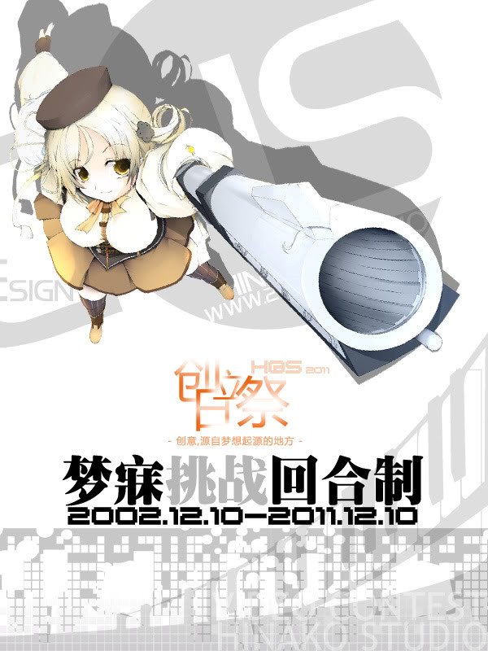

9. BGM新年祭（无官网，可至SKM或FL Snow观看）

BGM新年祭是以BGM新人团的作者为主体在新年期间举办的活动，除了发表MAD作品以外也会发布新年贺图，作品也多有欢乐恶搞的类型。

主办人盒子表示2013年应该会将活动更名后继续举办。

10. BGM MAD新人战（无官网，可至SKM或FL Snow观看）

（第二届活动官网：[http://bgmad.org/battle/](http://bgmad.org/battle/)）

由资深作家盒子君主办，面向新人为主的MAD Event。在2011年8月19日首次举办，作品水准中上。新人战的一大特色是评点非常详尽，对于需要了解自己作品优缺点的作者颇有助益。

---

以下是中国大陆已停办数年，可能不会再有后续的活动：

1. 动漫FANS2010冬季MAD创作大赛

举办过数次的MAD赛事，同时也是唯一商业化取向的MAD比赛。参赛作品数量极大，适合完全的新手参赛，但由于商业化经营以及排外（注8）的因素，观赏到MAD圈内老作家的作品之几率极低。

#### 3-1-3 台湾MAD活动

台湾的MAD活动相形之下较不发达，以歌谣祭较有特色。

1. MADeMAD（每年一次的定期EVENT）

（2012年活动网址：[http://bgmad.org/mademad/](http://bgmad.org/mademad/)）

MADeMAD整合了来自中台美日等地的Madder们，当前的参赛制度为半邀请制。活动方式类似于新人选拔的对抗赛，作品之间水准中平，且差异颇大。特色是在赛程中会提供纪念桌布等特殊物品供保存用。2011年该届台湾组织HS M@D组的作家大量参赛，使赛事更加具有多元风味。

2012年该届首度与BGM团合作设立了独立的HTML形式官网。

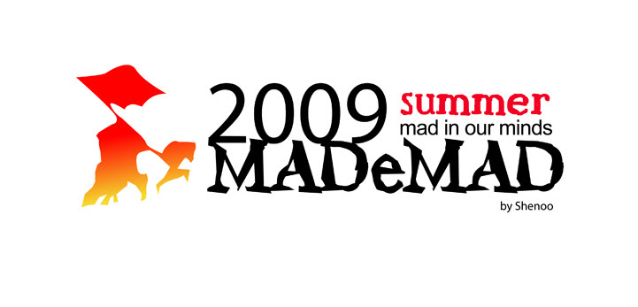

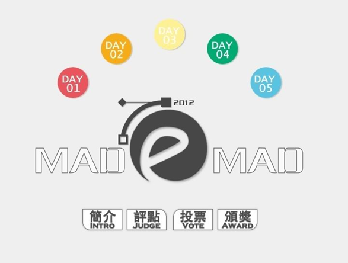

2. MAD大乱斗（2011年3月1日~2日举办第一届完毕）

此为台湾HS MAD组发起的MAD展示活动。

由于HS以振兴台湾MAD界为取向，因此本活动限定为台湾人参加。

3. 各大专院校歌谣祭（每年一次的定期EVENT）（[http://wineswordgod.myweb.hinet.net/](http://wineswordgod.myweb.hinet.net/)）

严格说来歌谣祭很多大学均有举办，然而由国立中央大学和海洋大学的社团所发展起来的祭典是最有名的，进行模式为事前由社团同学剪接好影片并配乐，然后在当天由入场观众点播并同时一起热唱，有如演唱会的气氛一般。

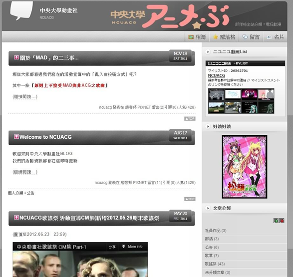

### 3-2 各国大赏

#### 3-2-1 日本MAD大赏

1. あなたが選ぶ静止画M@D大賞(每年一次的定期EVENT)

每年年初到二月左右对前一年的静画系作品进行评选的活动，非日本本土的作家亦可列名。

每年均会公布新人赏/最佳百大MAD赏/最佳创作者赏，是为静画系作品最具代表性的排名榜。

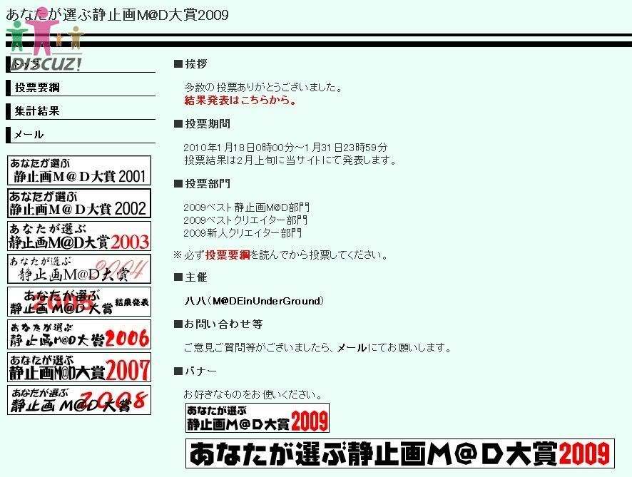

#### 3-2-2 欧美MAD大赏

1. A-M-V.Org Viewer’s Choice Awards（VCAs）（每年一次的定期EVENT）

AMV.com每年在年初到三月初举办的前一年间最佳AMV评选活动，并不会同步发表新作。

评选内容上分类相当细致，如果喜爱高水准的AMV不可不看。

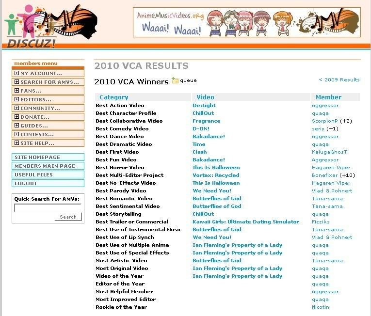

#### 3-2-3 俄国MAD大赏

1. AKROSS CON（每年一次的定期EVENT）

俄国每年从前一年年底一直到东正教圣诞节前后进行的活动，评选方式与AMV.com大致相同。

AMV水准亦高，喜爱者不可错过。

#### 3-2-4 韩国MAD大赏

1. RMS青白MAD合战

韩国目前规模最大的MAD合战。

第一届于2008.12.26由Rhythemical Motion举办，赛程规划仿日本红白战模式。

第二届于2011.8.25开始，但作品水准明显下滑。

*RMS的全称是Risky Madmovie Syndrome。（网址：[http://cafe.naver.com/anymadmovie](http://cafe.naver.com/anymadmovie)）

2. Madmoviecontest

Madmovie contest是历史最长之MAD赛事，至2010年9月已举办至第六届。

##### 3-2-4-1 韩国作者与团体浅介

**Lakei**：活跃于2006-2008年的南韩女性mad作者，长于静止画mad制作，晚期作品已具有日系一流mad水准。09年考上首尔附近的医事大学以后，因为学业繁忙宣布引退。

著名作品：

- [MAD]水月之影-물과달의 그림자

- [AMV]合作-The Stories

- [MAD]沙耶之歌- A Song of Dandelion

- [AMV]Ef-A Tale of Memories-We AreHere

- [MAD]Little Busters-Are You Waiting ForMiracles

**Duet**：专长于AMV制作的作者，至今已较少活动。

著名作品：

- [AMV]Ef-A Tale of Memories-You And Me Together

- [AMV]涼宮春日系列-Dance of Haruhi

**Lepusnette**：新兴的mad创作团体，原先只制作商业用的特效影片，后转兼创作madmovie。

著名作品：

- Atonement

- Reset

- [MAD]沙耶之歌- A Song of Dandelion

网站：[http://lepusnette.aquz.biz/FrameSET.htm](http://lepusnette.aquz.biz/FrameSET.htm)

**Rhythemical Motion**：南韩当前主要的MAD团体，特色是分工化，作品中也不会标明个人负责处理的项目，一律是以团体名出品。该团体目前也是南韩MAD界赛事正规化的主要推手，大型赛事几乎均由其主办。

著名作品：[AMV]合作-Last Night On Earth[合作（Rhythmical Motion）]

网站：[http://cafe.naver.com/anymadmovie](http://cafe.naver.com/anymadmovie)

*以上列举作品基本上以darklore有入库的档案为准。

---

## 附录A 各式短片细部分类表

一.MAD系统

静画系MAD：以漫画为主要素材

GMV：以游戏为主要素材

动画系MAD：以动画为主要素材（即AMV）

混合系MAD：混合了各种ACG素材同时使用，没有特别多用哪类

二.MTV

MTV是一种音乐影片，最初通常是为（歌手或为卡通，电影等）做官方宣传而制作的。随着晚近个人电脑的飞速进步，独立制作MTV也逐渐常见。也因为如此，音乐系AMV与MTV的分界线开始模糊。

大致上来说在ACG界，音乐系AMV跟MTV有三个重要的不同点：

1.官方制作与否

官方制作者称为MTV，反之则为AMV。（参照MAD的定义一节）

2.字幕的有无

通常有字幕的都较接近MTV，没有字幕的就是AMV。

3.特效技术的高低

大多数情况下，音乐系AMV仍然注重使用特效。MTV虽然也有特效，但不注重这个。

三.CM

CM就是广告短片的缩写，一定是官方制作的。

四.OP/ED

OP是Opening的简写，泛指开头影片或开头音乐。

ED是Ending的简写，泛指结尾影片或结尾音乐。

有时会看到NCOP/NCED等字样，前方的NC是No-Credit的缩写，指该OP/ED没有字幕及工作人员列表。

五.PV

PV意指Promotion Video，即推广用影片，一般由有爱人士或官方制作用来宣传该原作。

六.特典

特典通常都是发行DVD后才会附在DVD内流出的影片，将它单独分成一类其实是不正确的，因为特典可以是任何类型的影片……最常见的就是附送NCOP/NCED。

## 附录B 历届MAD大赏杰出作品列表

*谨列出2009年以后有收集之赛事，旧资料请参阅站内其他列表帖。

2012 BGM 新年祭(2012)

    (BF-2012_MAD)[CasterNick]PZOS
    
    (BF-2012_MAD)[SMile灬乖乖]新年祭
    
    (BF-2012_MAD)[Uncle_Lucifel]Horizon50%
    
    (BF-2012_MAD)[v1]βios折（忆）
    
    (BF-2012_MAD)[WEILIANG06]伙伴们的意志
    
    (BF-2012_MAD)[Z·DARK]OVERLOCK
    
    (BF-2012_MAD)[っ冰葑♂呖駛]缘之空+[dm]
    
    (BF-2012_MAD)[小无]高同步~永远的克劳德
    
    (BF-2012_MAD)[小能缺了灬]54213GINTAMA
    
    (BF-2012_MAD)[水户星岚]愿望の果てにあります
    
    (BF-2012_MAD)[水户星岚]愿望の果てにあります(V2)
    
    (BF-2012_MAD)[左手为恶魔]Numb
    
    (BF-2012_MAD)[石头]神奇的日常
    
    (BF-2012_MAD)[江户川傲气]御版@木山老湿篇
    
    (BF-2012_MAD)[壱识]只属于这里的故事
    
    (BF-2012_MAD)[東風谷⑨香]ELK_TYPE
    
    (BF-2012_MAD)[星宫凉一介]new_jonuery
    
    (BF-2012_MAD)[恋の镇魂曲]品尝命运的果实
    
    (BF-2012_MAD)[恋战★小殇]それを解く
    
    (BF-2012_MAD)[浮雲]儚くも永久のカナシ
    
    (BF-2012_MAD)[猪宝宝]_confuse_black_with_white
    
    (BF-2012_MAD)[結城音無]荧光
    
    (BF-2012_MAD)[黯夜影殇]And_I_m_Home
    
    (BF-2012_MAD)[满梓禾]Atomic
    
    (BF-2012_MAD)[满梓禾]Atomic v2
    
    (BF-2012_MAD)[Hinako]2012新年祭 ED

2011黑组(2011)

    黒組スペシャルＯＰムービー
    
    SugarDays
    
    ご飯が無いなら、私たちをオカズにすればいいじゃない☆
    
    [黒組]フラッシュメモリ徳光 – one hour photo(公開用)
    
    SakuraMai Mad Studio[Hoshino@yuu]
    
    らっとβその3（酢豚味）
    
    笑顔の庭
    
    [MAD]天使の羽根を踏まないでっ『内なる雨』_配布用
    
    日常モリモリ
    
    I love you who love me
    
    Magic Luv
    
    the lucid dream – kurogumi ver.
    
    BLovers-元ファイル
    
    Raspberrytart poc.ver
    
    黒組( ﾟдﾟ )ファイル公開用
    
    合作 Wizard_Gamer
    
    Revival Edition
    
    腐った羊羹の匂いがする！
    
    めくらやなぎと眠る女(公開用)
    
    夏バテに夢寐

BGM MAD新人战(2011)

    激情燃烧的彼女岁月  by 水戸星岚
    
    昨天晚餐的配菜是盐烧鲭鱼……吧？  by 壱识
    
    Puella Magi-浄化-  by T.&amp;.Omelet
    
    iwasawa  by 脑壳空空
    
    あの日見た景色, 忘れないように  by 左撇子棋手
    
    Just one last dance  by youk
    
    ヒカリ  by 秘银疾走
    
    守护你  by 幻耀天空
    
    KATEの夜  by 花杀风
    
    レッド(红)  by X.z_CA
    
    Scarlett  by 秋风
    
    深海少女  by 猪宝宝
    
    Regeneration  by KOTOBA
    
    快要坏掉的八音盒的心  by 南瓜
    
    AFTER EDEN  by 隙间之人形兔
    
    Radiance  by SY菌
    
    BLACK★ROCK SHOOTER THE M@D  by 好闲的鱼
    
    Affirmation of Aria  by 天才匡爷
    
    Again Again and Again  by 罐子
    
    Left for the devil  by 左手为恶魔 
    
    云的链接处  by AG君
    
    剪辑-海贼王  by 随风缘
    
    魔法少女まどか☆マギカ—目击者  by Shadow-Light
    
    Catch me if you can  by LEO(梨子)
    
    Salamander焚烧者-Hellsing  by lucifel
    
    FATE-命运待夜临  by 嘉拉迪雅
    
    青空之泪  by N.ec鱼丸

MADeMAD 2011(2011)

    [MAD]我们仍未忘记那年所捡人偶的名字
    
    [MAD补完计划]
    
    (合作)変わるのですか
    
    學園 S.O.S!!
    
    [MAD]Madooooooooooooka
    
    朝色
    
    記憶と夢
    
    DIDUDIDA
    
    op模仿
    
    創造自己的《Grand Chase》
    
    【Exclusion】
    
    R.M.S. 위험한 매드무비 증후군
    
    MAD[もう一度　立ち上がる]
    
    最後的願望
    
    Another day

わくわくアルバム2-嬲られる僕の思い出-(2010)

    [AMV]Angel Beats!-Live A LIVE (Alchemy PV風)[枝切司]
    
    [AMV]Angel Beats!-Spica[わくわくさん]
    
    [AMV]Angel Beats!-YoU and I(WEB公開用)[枝切司]
    
    [AMV]TigerXDragon-夕焼けおまんちっく(修正版)[一本杉]
    
    [AMV]TigerXDragon-夜空のベルガモット(修正版)[一本杉]
    
    [AMV]空之境界-わたしのためにしんで[将]
    
    [hatter] 「きんぴらは、ごぼうとにんじんで出来ている。」
    
    [MAD]Judas-死神狩獵者-禁断の扉-Gate of Eden-[幸鳥]
    
    [MAD]そして明日の世界より-October Sky(修正版WEB公開用)[枝切司]
    
    [MAD]どろぼうの名人-夢の論理は 隠喩と共感でできている_wkwk[hatter]
    
    [MAD]文學少女-たまひよ[にわとり]
    
    [MAD]永生之酒-Crack Stage[蒼緋]
    
    [MAD]合作-日出づる國[指令]
    
    [MAD]恋もよう雨のち晴れ-あさださんとたかぎくん[一本衫]
    
    [MAD]恋色空模様-パラサマ![かえる]
    
    [MAD]戲言系列-戯言論[まわる]
    
    第四次红白MAD合战(2010)
    
    [MAD][Goldwing]REQUIEM～親愛なる友へ～
    
    [MAD]Amagami-バカと紳士と仮面優等生[Face’s]
    
    [MAD]Ef-A Tale of Memories-Amnesiac Luv[御剣誄]
    
    [MAD]Fate-Stay night-The End of Oath[Yakumo]
    
    [MAD]Love Plus-Colorful Days[papa]
    
    [MAD]Natural Another One 2nd-Belladonna-Perfume Side AntiLovers [ネクロでぃすく]
    
    [MAD]水月-Traumerei -箱庭の夢想曲-[＋Holy Cross＋]
    
    [MAD]合作-悠久サクラメント[アルル]
    
    [MAD]素晴らしき日々-不連続存在-Cantus FirMus[朝奈]
    
    [MAD]素晴らしき日々-不連続存在-Gleaming Sky[こがらし]
    
    [MAD]虛軸少女-Fake Doom Fakers[龍花]
    
    [MAD]蜂蜜四葉草-まだ花は[藩田志信]
    
    [MAD]僕がみた月[まわる]
    
    BSK-Complete-[策謀琥珀]
    
    砂糖菓子の弾丸は撃ちぬけない[ひとみすいれん]

あなたが選ぶ静止画M@D大賞2009前20

    第一位-ゆのっちが可愛すぎて生きていくのが辛い。(完成版)
    
    第二位-■■と、偽りの救世主(公開版)
    
    第三位-夏の欠片、地図に無い島[後編]net
    
    第四位-ヨワイボクラノウタ
    
    第五位-神のみぞ知る世界
    
    第六位-「Pai’N Au ChoCo：Lat」
    
    第六位-快速特急　瞬間のシネマ号
    
    第八位-monochrome filtre de vierge ＋ mensongeverite
    
    第九位-幸福な未来に再見!
    
    第九位-サクラデリセット
    
    第十一位-『Tales of Tomorrow』
    
    第十二位- 好きだよ（日语版）
    
    第十二位- 好きだよ（国语版）
    
    第十四位-Oversold Cemetery -catacomb-
    
    第十四位-The Magic Hour（修正版）
    
    第十六位-蒼穹の世界
    
    第十七位-「あなたのことが、好きになりまひた」
    
    第十八位-21g
    
    第十九位-Cyanic Inscription
    
    第十九位-エトナでGOGO3

## 附录C 其他MAD相关站点

**MAD Underground**（[http://double-eight.net/mug/links/a-z.htm](http://double-eight.net/mug/links/a-z.htm)）

[日本MAD作家个人或集体的网站Bookmark，想了解日本作者近况很好用]

**iVocaloid**（[http://bbs.ivocaloid.com/forum-27-1.html](http://bbs.ivocaloid.com/forum-27-1.html)）  

[MMD资料的重要汇集地之一，MMD的资源应有尽有]

**VPVP**  

[全世界最详细的MMD资源与教学总站！不过是日文站点，需要会点日语才能看]

**HS MAD Team**（[http://pat-anime.com/forumdisplay.php?fid=113](http://pat-anime.com/forumdisplay.php?fid=113)）

[台湾最主要的作家聚集地，主要MAD版之一]

**FL Snow MAD Team**（[http://bbs.flsnow.net/index-htm-m-bbs-cateid-29.html](http://bbs.flsnow.net/index-htm-m-bbs-cateid-29.html)）

[中国大陆MAD组织FL Snow的本家，目前是中国主要MAD版]

**Sakuramai MAD Team**  

[中国大陆MAD组织Sakuramai的本家，亦是中国主要MAD版]

**RL MAD Team**（[http://www.sosg.net/thread.php?fid=262](http://www.sosg.net/thread.php?fid=262)）  

[中国大陆MAD组织RL目前的本家，常常迁移]

**MAD Nico 中文字幕组**（[http://nico.pixnet.net/blog/category/1512522](http://nico.pixnet.net/blog/category/1512522)）

[收集Nico上出现的佳作并加上字幕的组织，可以发现不少好作品。（可惜字幕是内嵌的，据说有制作外挂字幕，但是笔者没看到过）]

**MADer资料库**（k）  

[HS MAD组长的个人网站，也是他的MAD教学资料中心]

**MD上的蓝色天空**  

[台湾MAD Collector Darklore的个人站，已封闭，似乎打算重开，观察中]

---

## 注

注1：转载并重新编写自MAD情报格纳库/原载网站为M@D黑历史，作者CCSX

注2：参考Wiki英文版对AMV的解释文：“Anime music video”

注3：为证实这一点，笔者在AMV.com观赏了185个AMV，除了一个作品“Recollection”以外，其它均使用动画素材。

注4：沾不上边的东西日本人照样用来做MAD……真人MAD，比方说2006年红白MAD战的数部影片，如果想体验其糟糕程度，不妨到2CHA下载“传说中的C3B影片”观看……

注5：“Eternal Blaze ～君は光の天使～”以及“Cloud of Cronus”这两部作品。当然还有更多，不过这已经足够证明了。

注6：参照2004/2005年的“静止系MAD大赏”。

注7：感谢Pirrysal提供2001-2005静止画MAD大赏资料。

注8：动漫FANS曾数次驱逐SKM的论坛交流人员，并给予其砍账号、删文、封IP的待遇，却拒绝撤下由这些人员制作的MAD， 因此受到部分SKM作家的强硬抵制。

注9：四四事件是指2010年四月三日至五日间发生的MAD抄袭事件，起因是SKM的Madder发现百度猫耳属性吧的“hottt67（不吃麵條的HO君）”宣称日本作家PAPA的作品为其所制作（后改宣称为协力制作），诘问后遭到该吧小吧（副版）主及HO君的强力否认，由于双方皆认为遭到羞辱，激烈的冲突因此爆发。四月四日，基于抄袭证据明确，以SKM人员为主，华语MAD界空前团结起来，几乎所有大型组织均有人参与声讨。猫耳属性吧HO君最终道歉结束了此次风波，然而此人在MAD界遭到抹杀显然已经无法避免。